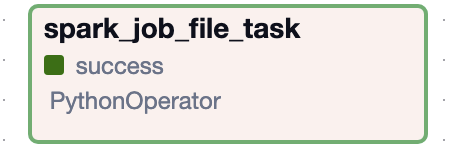
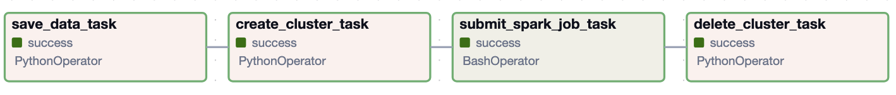
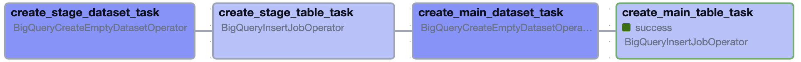

# Austin Service Explorer

<h2 style="color:#777;">1. Project's description</h2>

This is a Data Engineering project created as a part of Data Engineering Zoomcamp. The main goal of the project is to seamlessly transfer data from the source into data analytics dashboard using data engineering tools.
The project aims to leverage the wealth of data available from the City of Austin Open Data portal. Specifically, it collects over 1.8 million service requests originating from the City of Austin and its metropolitan area, sourced from the CSR production system. This dataset spans back to 01/03/2014 and is updated daily at 4:00 am. The data encapsulates various service requests made by residents, covering issues ranging from park maintenance to broken traffic lights and beyond.

Purpose:
The project attempts to collect the city's service requests data and prepare it for the data analysys, and deliver actionable insights. I use Airflow as an orchestration tool that coordinates the workflow: data extraction, preprocessing, storage, and transformation. 

Extracting:
* The data was retrieved through API requests.

Preprocessing: 
* The correct data types were assined to the collected data, performed formatting, dropped non-meaningful columns and redundant information.

Storage: 
* The preprocessed data is stored on the Google Cloud Storage bucket as a collection multiple _parquet_ files.

Transformation: 
* With the help of PySpark the data was cleaned and standartized to ensure its quality. For example, values like _Austin, AUSTIN, AUS and austin_ replced with only one standard _Austin_, all errors in city names and locations were removed. In data transformation step I performed as well feature engineering and created new columns, for example: generalizing types of service requests, bringing them down to phone, email, web, app, and other; created the column that calculates how long the case was opened, extracted the values like month and year.

Load:
* The transformed data is saved on GCS bucket and loaded into BigQuery as an external table. With the help of SQL query I created as well a table that is partitioned by date, using monthly intervals, and clustered by the method, the service request was received. This transformations help to optimize the SQL queries performance.


<h2 style="color:#777;">2. Technology stack of the project</h2>

* Infrastracture as Code: Terraform
* Data Lake: Google Cloud Storage
* Data Warehouse: BigQuery
* Orchestration: Airflow
* Data Transformations: Spark
* Serverless Cluster Service: Dataproc
* Containerization: Docker
* Data Visualisation: Looker


<h2 style="color:#777;">3. Prerequisites</h2>
<details><summary><i>Expand</i></summary>
To reproduce this project you need to have a Google Cloud Account (additional cost may apply), have Docker and Docker Compose installed, have at least 10GB of free space to load docker images and start the project. 
</details>

<h2 style="color:#777;">4. Installations</h2>

Please, make sure that you have all needed installations and install the missing ones following the instructions provided below.

### Docker
<details><summary><i>Expand</i></summary>

```bash
sudo apt-get update
sudo apr-get install docker.io
```
</details>

### docker-compose
<details><summary><i>Expand</i></summary>

1. Check if you have `~/bin/` directory. If not, create on with the command 
`cd && mkdir bin`
2. Move to the `bin/` with the command `cd bin`.
3. Download the binary file from [Docker's GihHub repository](https://github.com/docker/compose/releases).
```bash
wget https://github.com/docker/compose/releases/download/v2.24.1/docker-compose-linux-x86_64
```
4. Rename the file to `docker-compose`
5. Make it executable `chmod +x docker-compose`
6. Open `.bashrc` file by running command `nano ~/.bashrc` and add the following line of code in the end of the file:
```bash
export PATH="${HOME}/bin:${PATH}"
``` 
7. Run `source ~/.bashrc`
8. Check if docker compose works:
    * `which docker-compose` should return the path to `~/bin/docker-compose`
    * `docker-compose --version` should return the version you installed.

</details>

### Terraform
<details><summary><i>Expand</i></summary>

1. Download a binary file from [Terraform site](https://developer.hashicorp.com/terraform/install)
2. Unzip it into the `~/bin` directory.
3. Check the terraform version by running a command `terraform --version`

</details>

### Google Cloud SDK _- Optional_
<details><summary><i>Expand</i></summary>
Google Cloud SDK will be installed automatically on project's Docker Image. If you'd like to install it locally as well, follow the official installation guide from [Google Cloud](https://cloud.google.com/sdk/docs/install)

</details>

<h2 style="color:#777;">5. Google Cloud Credentials</h2>

To use Google Cloud SDK, Terraform and run the project's code, you need to provide the access to your Google Cloud Account. With the steps below, you can prepare your GCP account for the project. 

<details><summary><i>Expand</i></summary>

1. On GCP create a project.
2. Enable API's for your project:
    * [Identity and Access Management (IAM) API](https://console.cloud.google.com/apis/library/iam.googleapis.com)
    * [IAM Service Account Credentials API](https://console.cloud.google.com/apis/library/iamcredentials.googleapis.com)
    * Compute Engine API
    * Cloud Dataproc API
    * BigQuery API
    * Bigquery Storage API

3. Navigate to __IAM & Admin__ -> Service Accounts.
4. Create a new service account for the project. Make sure to add the following roles into it:
    * BigQuery Admin
    * Compute Admine
    * Storage Admin
    * Storage Object Admin
    * Dataproc Administrator
    * Owner

5. Click on the name of the service account and move to keys. Create a `*.json` file with a key, download it, and rename as `apd311.json`. In the root dicrectory create a folder `.gc` and move the key file into that folder:

```bash
mkdir ~/.gc
mv apd311.json ~/.gc/apd311.json
```
Alternativaly, you can store it in your preffered location and replace the location to the file everywhere in the code.

_The next 2 steps are valid only for those, who choose to install Google SDK locally:_
6. To add the environment variable with your credentials run in the terminal:

```bash
export GOOGLE_APPLICATION_CREDENTIALS="~/.gc/apd311.json"
```
If you don't want to manually add credentials path each session, you can add the code above into `~/.bashrc` file.
7. Authentificate Google SDK.
```bash
gcloud auth application-default login
```
</details>

<h2 style="color:#777;">6. Reproduce the project </h2>

1. Clone the project from GitHub
```bash
https://github.com/nadia-paz/apd311.git
```
or download it by clicking on Code -> Download ZIP

2. In the terminal move into the project's folder `apd311`.

**Note!!!** Bucket and project names are unique accross Google CLoud Platform. You won't be able to create and/or use the same variables that I do. For reproducing the code you'll need to replace     `GCP_PROJECT_ID` and `GCP_GCS_BUCKET` values with your own.

3. Run the commands `terraform init` and `terraform apply`. 

4. Move back to the airflow directoy `cd .. && cd airflow`

5. In addition to `dags` directory, you'll need to create `config`, `jobs`, `lib`, `plugins`, and`logs`. 
```bash
mkdir config jobs lib plugins logs
```

6. Now we are ready to start our Docker. First, we need to rebuild the official airflow image to fit our needs. Then we are ready to start **Airflow**. In the `airflow` directory step by step run the commands:
```bash
sudo docker build . -t airflow-plus:latest
docker-compose up airflow-init
docker-compose up -d
```

With the command `docker ps` check if all containers started. You should see:
* airflow-webserver
* airflow-scheduler
* spark-worker
* spark-master
* postgres

7. If everything runs OK, we can login into Airflow Web. In the browser go to `http://localhost:8080`, enter the *login*: `airflow`, and *password*: `airflow`. On the home page you will see 3 DAGs (Directed Acyclic Graphs), that organize tasks together. Activate all DAGs by clicking on toggle button next to them.

### DAGs and Tasks

#### `upload_spark_file`
Runs -> once on April, 19 2024, not scheduled.
Contains one task `spark_job_file_task` that uploads the file `spark_job.py` to Google Cloud Storage.



#### `pipeline`
* Runs -> scheduled to run every week on Sunday at midnight GMT. 
* Start date: April, 19 2024. 
* End date: June 30, 2024
* Tasks:
    * `save_data_task` -> extracts data from [City of Austin Open Data Portal](https://data.austintexas.gov/Utilities-and-City-Services/Austin-311-Public-Data) and loads it onto GCS bucket.
    * `create_cluster_task` -> creates Dataproc cluster on Google Cloud Platform
    * `submit_spark_job_task` -> submits Spark Job into Dataproc cluster.
    * `delete_cluster_task` -> deletes Dataproc cluster



#### `create_tables`
* Runs -> scheduled to run every week on Sunday at 4:00 AM GMT. 
* Start date: April, 19 2024. 
* End date: June 30, 2024
* Tasks:
    * _for external table:_
        * `create_stage_dataset_task` 
        * `create_stage_table_task`
    * _for partitioned table:_
        * `create_main_dataset_task`
        * `create_main_table_task`



To run dags you can manually trigger them in the order: 
* `upload_spark_file` >> `pipeline` >> `create_tables`

After the tasks finish their run, you can move to BigQuery to work with data. Look for dataset `apd311`, and table `main_table`.

<h2 style="color:#777;">7. Analyze data with Looker </h2>


<h2 style="color:#777;">8. Clean resources </h2>

1. In the terminal move to the `terraform` directory and run the command `terraform destroy`
2. Go to [Google Cloud Storge](https://console.cloud.google.com/storage) and manually delete Dataproc clusters.
3. Move to `airflow` directory and disconnect `Docker` by runnining command
```bash
docker-compose down --volume -rmi
```
`--volume` and `-rmi` are optional flags to remove all volumes (`--volume`) and images (`-rmi`) from your computer.

4. Delete the project's directory.